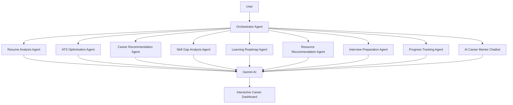

# 🚀 CareerPilot AI Agent

### An Autonomous Multi-Agent Career Intelligence & Learning Ecosystem


> AI-Powered Career Guidance Platform built using Agentic & Autonomous AI Architecture


---

## 📌 Project Overview

CareerPilot AI Agent is an intelligent **multi-agent AI system** that acts as a virtual career mentor for students, freshers, and job seekers.

The platform utilizes specialized autonomous AI agents coordinated through a central **Orchestrator Agent** to provide:

* Resume Analysis
* ATS Optimization
* Career Recommendations
* Skill Gap Detection
* Personalized Learning Roadmaps
* Resource Recommendations
* Interview Preparation
* Progress Tracking
* AI Career Mentoring

Unlike traditional career guidance platforms, CareerPilot AI continuously adapts recommendations based on user skills, goals, progress, and interactions.

---

## ❗ Problem Statement

Many students and freshers struggle with:

* Choosing the right career path
* Creating ATS-friendly resumes
* Understanding industry skill requirements
* Finding structured learning plans
* Preparing for interviews
* Tracking career growth

Most existing solutions provide static recommendations and fail to offer personalized career development support.

---

## ✨ Proposed Solution

CareerPilot AI Agent addresses these challenges using a collaborative multi-agent architecture powered by Google Gemini.

The system:

✅ Analyzes resumes automatically

✅ Calculates ATS compatibility scores

✅ Identifies missing skills

✅ Recommends suitable career paths

✅ Generates adaptive learning roadmaps

✅ Suggests learning resources

✅ Conducts interview preparation

✅ Tracks progress continuously

✅ Provides real-time career mentoring through AI

---

## 🤖 Core AI Agents

### 📄 Resume Analysis Agent

* Resume parsing
* Skill extraction
* Education analysis
* Experience analysis

### 🎯 ATS Optimization Agent

* ATS score generation
* Missing keyword detection
* Resume improvement suggestions

### 🧭 Career Recommendation Agent

* Role suitability analysis
* Career path prediction
* Personalized recommendations

### 📊 Skill Gap Analysis Agent

* Current skill assessment
* Industry requirement comparison
* Missing skill identification

### 🛣️ Learning Roadmap Agent

* Personalized learning plans
* Dynamic technology roadmaps
* Goal-based progression

### 📚 Resource Recommendation Agent

* Courses
* Documentation
* Tutorials
* GitHub repositories
* Learning resources

### 🎤 Interview Preparation Agent

* Technical questions
* HR questions
* Mock interview preparation

### 📈 Progress Tracking Agent

* Skill progress monitoring
* Roadmap completion tracking
* Learning analytics

### 💬 AI Career Mentor Chatbot

* Career guidance
* Technology recommendations
* Resume advice
* Learning support
* Continuous mentoring

---

## 🧠 Multi-Agent System Architecture



---

## 🔄 Agent Collaboration Workflow

```text
Resume Upload
      │
      ▼
Resume Analysis Agent
      │
      ▼
ATS Optimization Agent
      │
      ▼
Career Recommendation Agent
      │
      ▼
Skill Gap Analysis Agent
      │
      ▼
Learning Roadmap Agent
      │
      ▼
Resource Recommendation Agent
      │
      ▼
Interview Preparation Agent
      │
      ▼
Progress Tracking Agent
      │
      ▼
AI Career Mentor Chatbot
```

This workflow demonstrates how agents communicate and collaborate to provide personalized recommendations.

---

## 🧠 AI Memory Layer

CareerPilot AI maintains user-specific context through:

* Career Goals
* Skills Profile
* Resume History
* Learning Progress
* Interview Performance
* Chat History

This enables adaptive recommendations and personalized career mentoring.

---

## 🛠️ Technology Stack

### Frontend

* HTML5
* CSS3
* Bootstrap 5
* JavaScript

### Backend

* Python
* Flask

### Database

* SQLite
* SQLAlchemy

### Artificial Intelligence

* Google Gemini API

### Libraries

* PyPDF2
* pdfplumber
* Flask-Login
* Werkzeug
* python-dotenv

---

## 📁 Project Structure

```text
Agentic-Autonomous-Systems/

├── app.py
├── config.py
├── requirements.txt
├── .env.example

├── agents/
│   ├── orchestrator_agent.py
│   ├── resume_agent.py
│   ├── ats_agent.py
│   ├── career_agent.py
│   ├── skill_gap_agent.py
│   ├── roadmap_agent.py
│   ├── resource_agent.py
│   ├── interview_agent.py
│   ├── progress_agent.py
│   └── chatbot_agent.py

├── services/
│   ├── gemini_service.py
│   ├── pdf_service.py
│   └── resume_parser.py

├── database/
│   ├── db.py
│   └── models.py

├── routes/
├── templates/
├── static/
├── uploads/
└── docs/
```

---

## 🗄️ Database Schema

### Users

Stores user account information.

### Resumes

Stores uploaded resume files.

### Skills

Stores identified user skills.

### Career Recommendations

Stores generated career suggestions.

### Roadmaps

Stores personalized learning roadmaps.

### Progress Tracker

Stores milestone completion data.

### Interview Sessions

Stores interview evaluation results.

### Chat History

Stores chatbot conversations.

---

## 📊 Expected Outcomes

* Improved ATS Resume Scores
* Faster Skill Gap Identification
* Personalized Learning Plans
* Better Interview Readiness
* Continuous Career Development Support

---

## 📸 Screenshots

Add screenshots here:

* Dashboard Overview
* Resume Upload Page
* Resume Analysis Results
* Learning Roadmap
* Career Recommendations
* AI Career Mentor Chatbot

---

## 🧪 Installation

```bash
git clone https://github.com/yourusername/Agentic-Autonomous-Systems.git

cd Agentic-Autonomous-Systems

python -m venv venv

# Windows
venv\Scripts\activate

# Linux / macOS
source venv/bin/activate

pip install -r requirements.txt

cp .env.example .env

# Add GEMINI_API_KEY

python app.py
```

---

## 🔬 Research Contribution

CareerPilot AI introduces a collaborative multi-agent framework where autonomous AI agents communicate through an Orchestrator Agent to continuously analyze user progress, adapt learning pathways, and provide intelligent career guidance.

This architecture combines:

* Agentic AI
* Personalized Learning
* Career Intelligence
* Resume Analytics
* Conversational AI

within a unified platform.

---

## 🚀 Future Enhancements

* Voice-Based Career Assistant
* Mobile Application
* Real-Time Job API Integration
* Advanced RAG Implementation
* Multi-Language Support
* Industry-Specific AI Models

---

## 👨‍💻 Author

**Ayush Panda**

M.Sc. Information Technology(Artificial Intelligence) (2026)

CareerPilot AI Project

---

## ⭐ Support

If you found this project useful, consider giving it a star on GitHub.

---

## 📄 License

This project is developed for educational and research purposes.
